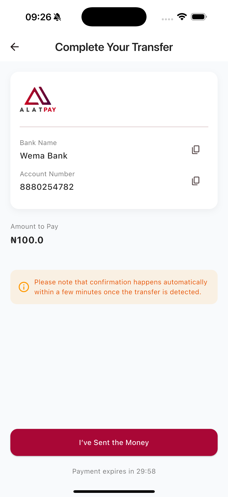
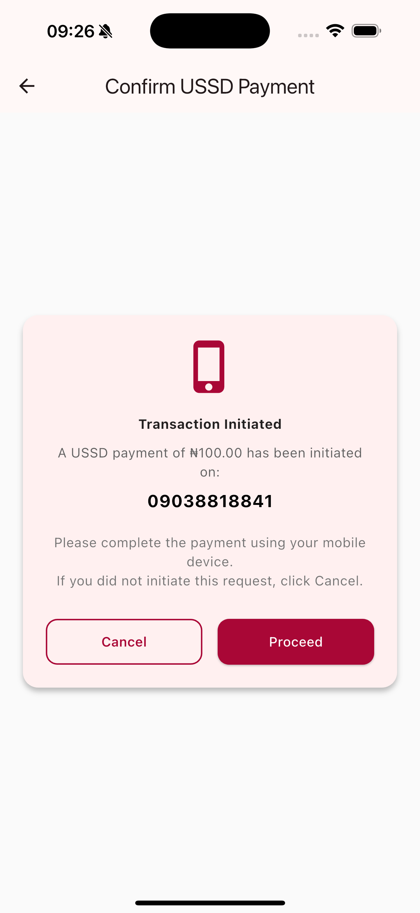
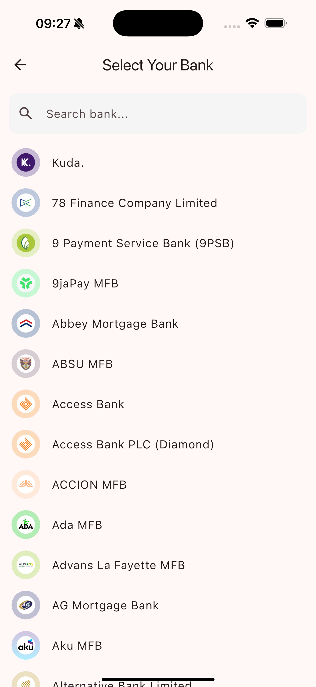
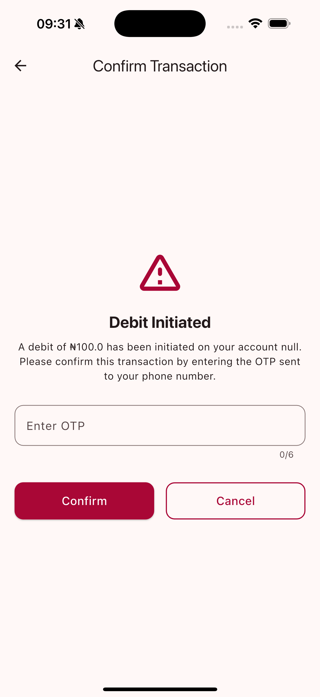

AlatPay SDK
================================================================================

A performant SDK for integrating AlatPay payment services into your Flutter applications.

1. Seamless payment initialization and verification for bank transfers, USSD and bank details
2. UI customization with AlatPayTheme and branding image

All via a simple, unified function

|                        Bank Transfer                         |                        USSD                         | 
|:------------------------------------------------------------:|:---------------------------------------------------:|  
|  |  |

|                        Bank Details                         |                        OTP                         | 
|:-----------------------------------------------------------:|:--------------------------------------------------:|  
|  |  |

_Above: The included example app._


Basics
================================================================================

Syntax
----------------------------------------

To initiate a payment , call the `AlatPaySdk.startPayment` method, and specify the required
props:

``` dart
    AlatPaySdk.startPayment(
      context,
      request: PaymentRequest(
      businessId: "****************",
      amount: 100,
      currency: "NGN",
      customer: Customer(
      email: "jane.doe@email.com",
      phone: "09038818841",
      firstName: "Jane",
      lastName: "Doe",
        ),
    ),
      secretKey: "****************",
      onPaymentComplete: (result) {
        Navigator.pop(context);
        ScaffoldMessenger.of(context).showSnackBar(
          SnackBar(
            backgroundColor: Colors.green,
            content: Text("Successful payment ${result?.message}"),
          ),
        );
      },
      onPaymentError: (panic) {
        Navigator.pop(context);
        ScaffoldMessenger.of(context).showSnackBar(
          SnackBar(
            backgroundColor: Colors.red,
            content: Text(panic.toString()),
          ),
        );
      },
    );
```

It also adds an `AlatPayTheme` class, which allows you to customize the look and feel of the payment
screens.

``` dart
AlatPayTheme (
  primaryColor: Colors.blue,
  secondaryColor: Colors.blueAccent,
  )
```

Branding
----------------------------------------

You have optional `branding` parameter to replace the AlatPay logo with your own image.

``` dart
      branding: "assets/images/branding.png",
```

Events & callbacks
================================================================================

`AlatPaySdk.startPayment` includes the following callbacks:

- `onPaymentComplete`: the payment was completed successfully, the call back returns a
  `PaymentResult` object
- `onPaymentError`: the payment failed, the call back returns a `String` error message, this
  callback only covers errors during the payment process, network errors, invalid parameters, etc

Errors such as invalid otp, invalid bank details, insufficient funds, etc are handled within the
payment flow itself and do not trigger this callback.


Installation
================================================================================

Grab it from [pub.dev](https://pub.dev/packages/alatpay_sdk/install).


